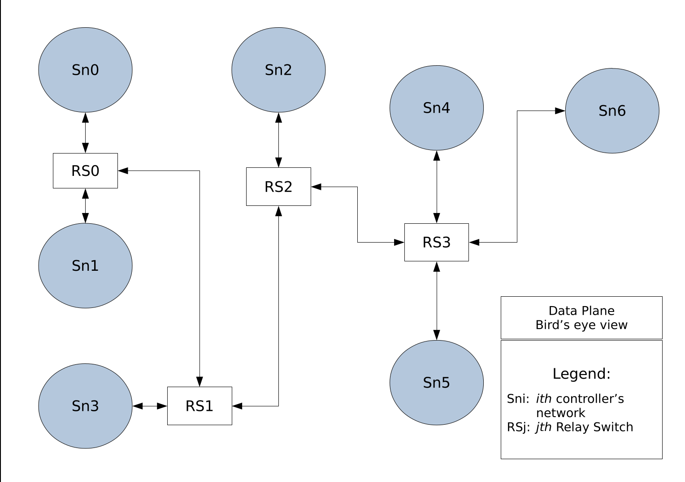
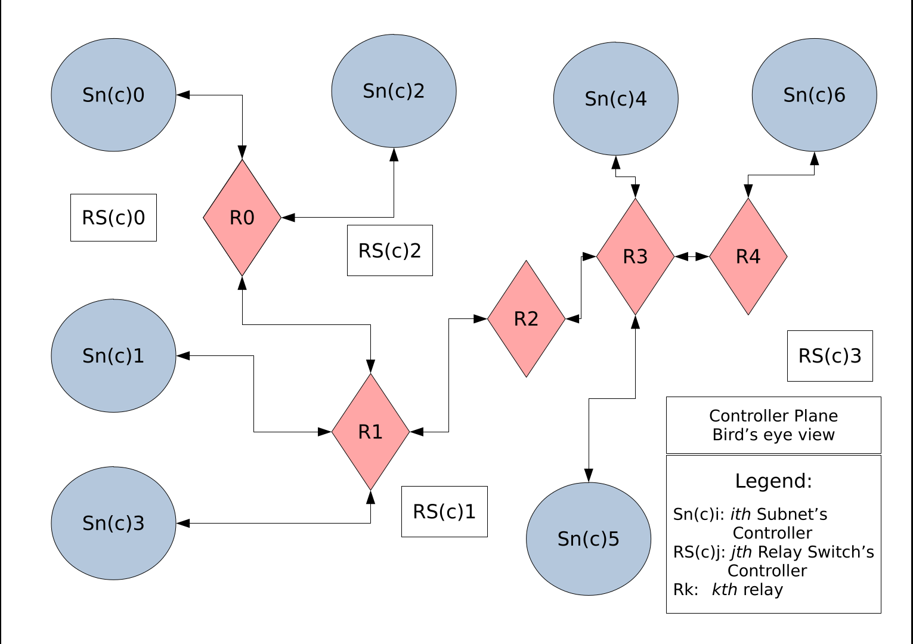
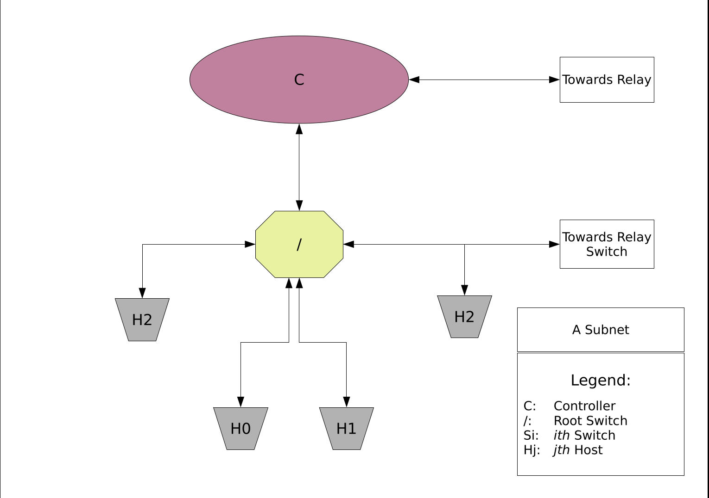
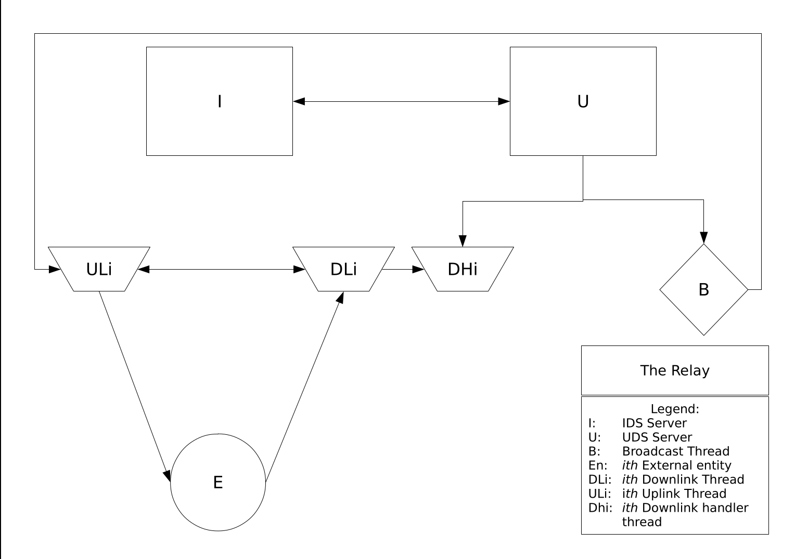
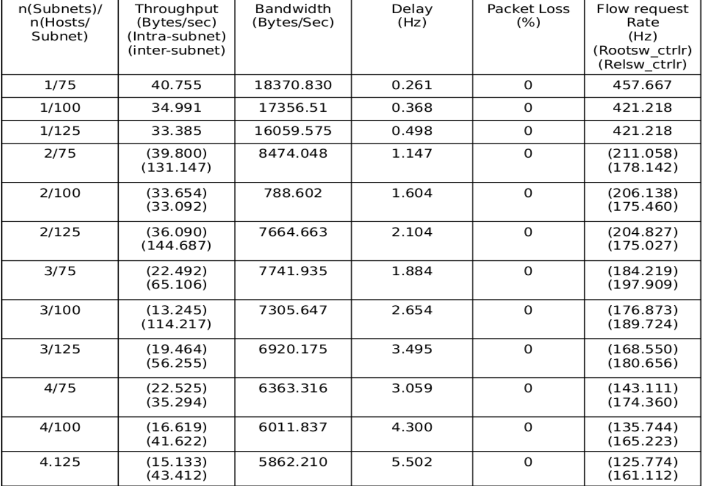
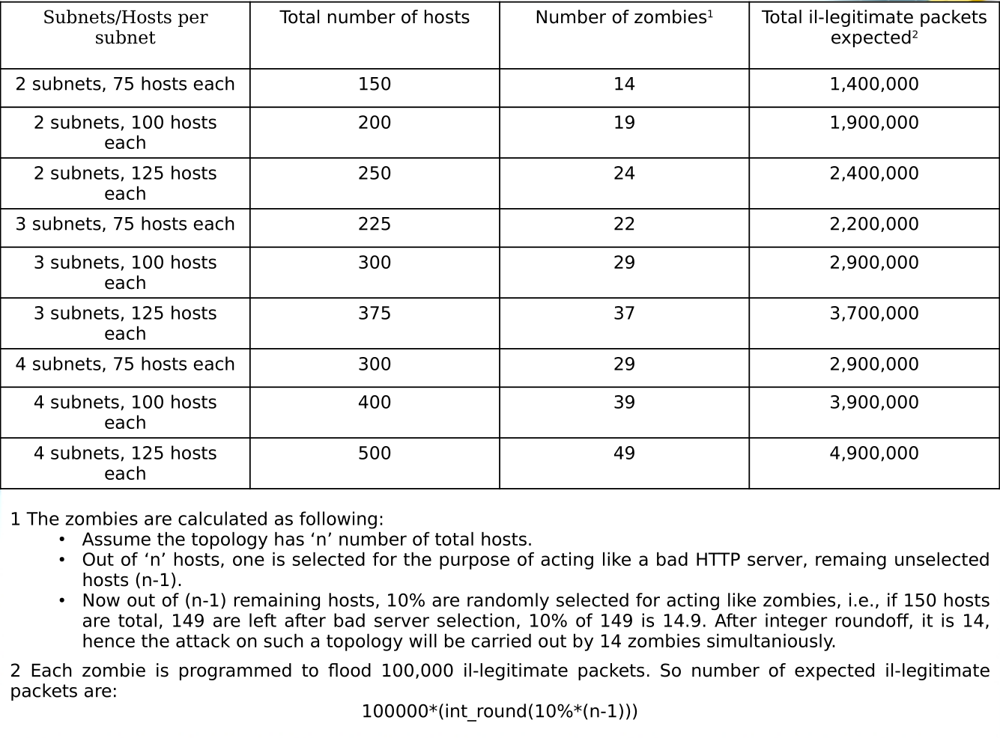
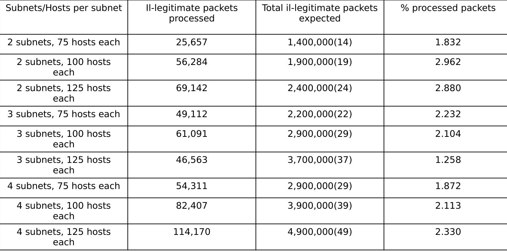
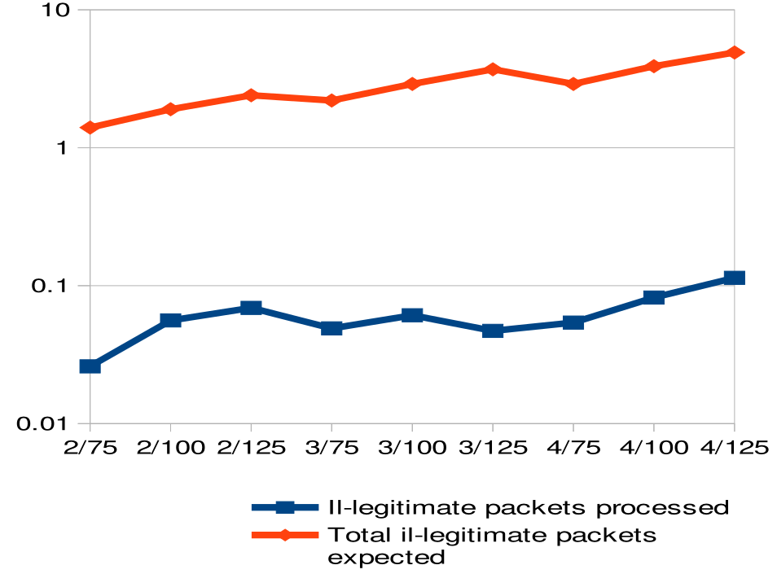
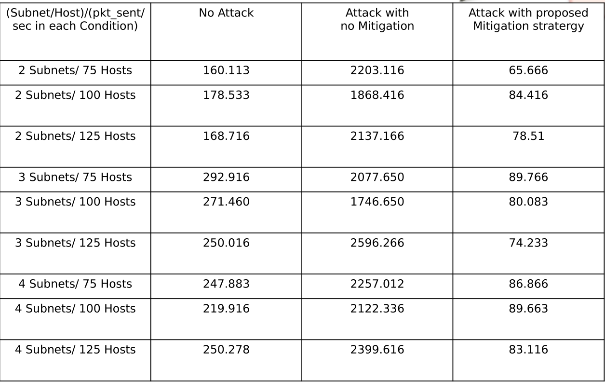

# Software Defined Networking: Distributed Systems and Trust Computation

### For the code, switch to the subrelay branch!

#### Introduction
This is an year long undertaking for Bachelors' End Term Project. It focusses on enabling distributed controllers in controller plane of Software Defined Networking regim to communicate instantaniously.

#### Highlights
* Development and implementation of autonomous Relay entity that enables realtime communication
* Testing of communication by mounting a DDoS attack on the created network and then blacklisting the malicious actors
* Automatic whitelisting of zombie nodes when DoS packet injection subsides
* Benchmarking this particular usecase of relay to give a glimpse of how much it can accomplish with such low overhead
* Implementation of customized Ryu[1] SDN Controllers in pre-compiled docker[2] containers
* Portable Python as programming language of choice

#### Architecture
The data Plane sees the addition of relay switches that facilitate in transmitting data between separate subnets

The Controller Plane sees the addition of the _relay_ (explained below in detail)

An Isolated Subnet (The basic template of how a subnet should look like)

#### What is Relay?

* The relay script is the facilitator of instantaneous communication within the distributed control plane of Software Defined Networking regime. It should exist in the Controller plane as it is just the transporter of information between other controllers.
* The relay is designed to facilitate communication within a number of subnets.
* The Relay can have any number of endpoints to which it extends its services to. These endpoints can be occupied by,
	* Controllers compliant with SDN
	* Other relays, just like the one extending the endpoints
* Relay script is just a TCP server endlessly listening for connections on one of its ports. As soon as an endpoint is detected to be occupied by an entity, it forks a subprocess to handle that particular end point only. The forked subprocess inherits a way to make contact to other such forked processes. These processes in conjunction, form the broadcast mechanism of the relay. All of them continually expect to receive a message from their respective endpoint and on such an event, pass on the message to all other processes, essentially broadcasting it.
* Due to this simplistic design, the only dependency the relay has is, the existence of TCP/IP communication by the entity connected to its end point. It really is a management system for communication within multiple clients of a single server process.
* Any controller supporting TCP/IP communication is automatically eligible for a full duplex connection to the relay. Having said that, due to lack of testing on real propriety software, we would like to have reservation to certain extent as untested code cant really be trusted. The ideology though, doesn’t assume any thing that any propriety SDN controller cannot provide, or can’t be extended to provide, for that matter.

#### The Real algorithm
The algorithm for the project can be found in documentation branch, reviews/algorithm.pdf

#### Observations
__The following is the output for various _Relay enabled_ topologies tested using the _pingall_ command of _Mininet___[3]

__The following is the test setup for which we conduct the comparitive study__

__The following two figures depict in tabular and graphical form, expected il-legitimate packets to what actually were processed with attack mitigation enabled__

__The following is a comparitive study of bandwidth with/without attack and mitigation enabled__

#### Future work
* Develop new methods of Relay deployment
* Make the whole network routing enabled, i.e. promote network to layer 3

#### Publication
Patent Application Pushed from __SRM Institute of Science and Technology__ with co-founder Nikhil Gupta and mentors Ms. Vaishnavi Moorthy and Dr. Revathi Venkataraman.

#### References
[1] [Ryu Controller Homepage](http://osrg.github.io/ryu/) 
[2] [Docker Homepage](https://www.docker.com/) 
[3] [Mininet homepage](http://mininet.org/) 
